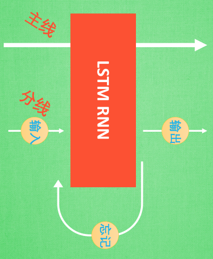
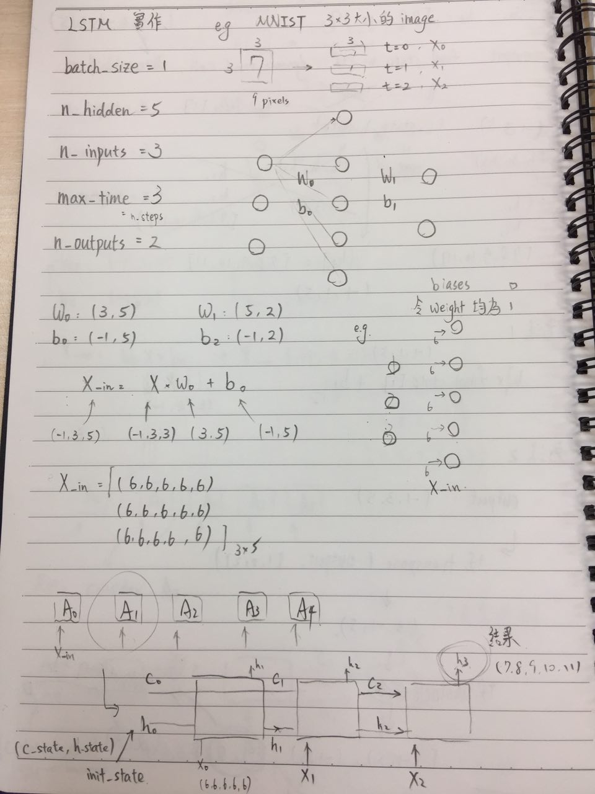
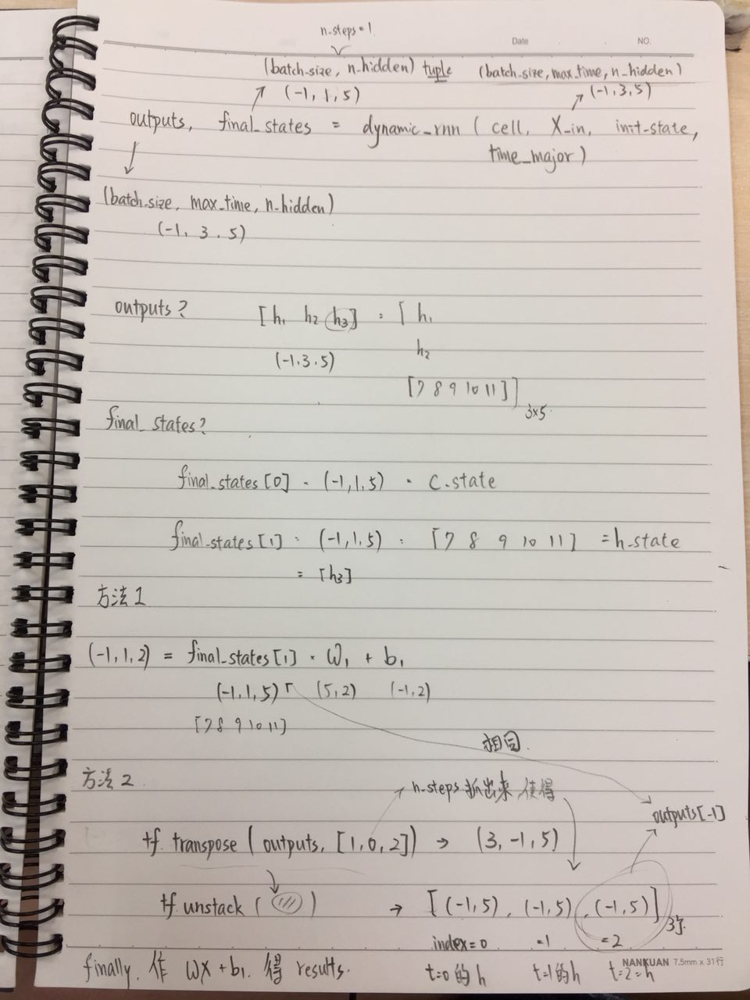

# LSTM


[https://blog.csdn.net/u010900574/article/details/51823962](https://blog.csdn.net/u010900574/article/details/51823962)

### 1. 把 $f_t, i_t, \tilde{c_t}, c_t, o_t, h_t$ 的式子看熟

### 2. 注意 peep hole 實作

[https://morvanzhou.github.io/tutorials/machine-learning/ML-intro/2-4-LSTM/](https://morvanzhou.github.io/tutorials/machine-learning/ML-intro/2-4-LSTM/)


## LSTM 直觀 



* 下半部就是一般的 RNN，比起一般的 RNN 他多了一個上面那條線，就是控制全局的記憶, 我們用粗線代替
* 為了方便理解, 我們把粗線想像成電影或遊戲當中的 主線劇情. 而原本的 RNN 體系就是 分線劇情.
* 三個控制器都是在原始的 RNN 體繫上
* 1.我們先看 輸入方面, 如果此時的分線劇情對於劇終結果十分重要, 輸入控制就會將這個分線劇情按重要程度 寫入主線劇情 進行分析
* 2.再看 忘記方面, 如果此時的分線劇情更改了我們對之前劇情的想法, 那麼忘記控制就會將之前的某些主線劇情忘記, 按比例替換成現在的新劇情. 
  * 所以 主線劇情的更新就取決於輸入 和忘記 控制. 
* 3.最後的輸出方面, 輸出控制會基於目前的主線劇情和分線劇情判斷要輸出的到底是什麼.
  * 基於這些控制機制, LSTM 就像延緩記憶衰退的良藥, 可以帶來更好的結果.


## tensorflow


```python
batch_size = 1
hidden_size = 5 # 就是 cell_state_size 
n_steps = 3 # 就是 max_time
n_inputs = 3 
n_outputs = 2

# create a BasicRNNCell
rnn_cell = tf.nn.rnn_cell.BasicRNNCell(hidden_size) # 5


# defining initial state
initial_state = rnn_cell.zero_state(batch_size, dtype=tf.float32) # 1

# input_data shape: [-1, n_steps, hidden_size]
# [-1, 3, 5]

# 啥是 max_time? 就是 n_steps = 3
# 啥是 cell_state_size? 就是 

# 'outputs' is a tensor of shape [batch_size, max_time, cell_state_size]
# 'state' is a tensor of shape [batch_size, cell_state_size]
outputs, state = tf.nn.dynamic_rnn(rnn_cell, input_data,
                                   initial_state=initial_state,
                                   dtype=tf.float32)
```

看圖比較好懂～


 




## 考慮 MNIST dataset


```python
batch_size = 128
n_inputs = 28   # MNIST data input (img shape: 28*28)
n_steps = 28    # time steps
n_hidden_units = 128   # neurons in hidden layer
n_classes = 10      # MNIST classes (0-9 digits)

x = tf.placeholder(tf.float32, [None, n_steps, n_inputs])
y = tf.placeholder(tf.float32, [None, n_classes])

weights = {
    # (28, 128)
    'in': tf.Variable(tf.random_normal([n_inputs, n_hidden_units])),
    # (128, 10)
    'out': tf.Variable(tf.random_normal([n_hidden_units, n_classes]))
}
biases = {
    # (128, )
    'in': tf.Variable(tf.constant(0.1, shape=[n_hidden_units, ])),
    # (10, )
    'out': tf.Variable(tf.constant(0.1, shape=[n_classes, ]))
}


def RNN(X, weights, biases):
    
    # 變成 2 維方便做 matmul
    # X ==> (128 batch * 28 steps, 28 inputs)
    X = tf.reshape(X, [-1, n_inputs])

    # X_in = (128 batch * 28 steps, 128 hidden)
    X_in = tf.matmul(X, weights['in']) + biases['in']
    
    # 再次變成 3 維
    # X_in ==> (128 batch, 28 steps, 128 hidden)
    X_in = tf.reshape(X_in, [-1, n_steps, n_hidden_units])

    cell = tf.nn.rnn_cell.BasicLSTMCell(n_hidden_units, forget_bias=1.0, state_is_tuple=True)
    
    # lstm cell is divided into two parts (c_state, h_state)
    init_state = cell.zero_state(batch_size, dtype=tf.float32)

    # dynamic_rnn receive Tensor (batch, steps, inputs) or (steps, batch, inputs) as X_in.
    # Make sure the time_major is changed accordingly.
    outputs, final_state = tf.nn.dynamic_rnn(cell, X_in, initial_state=init_state, time_major=False)

    outputs = tf.unstack(tf.transpose(outputs, [1,0,2]))
    
    results = tf.matmul(outputs[-1], weights['out']) + biases['out']    
    # shape = (128, 10)

    return results
```

